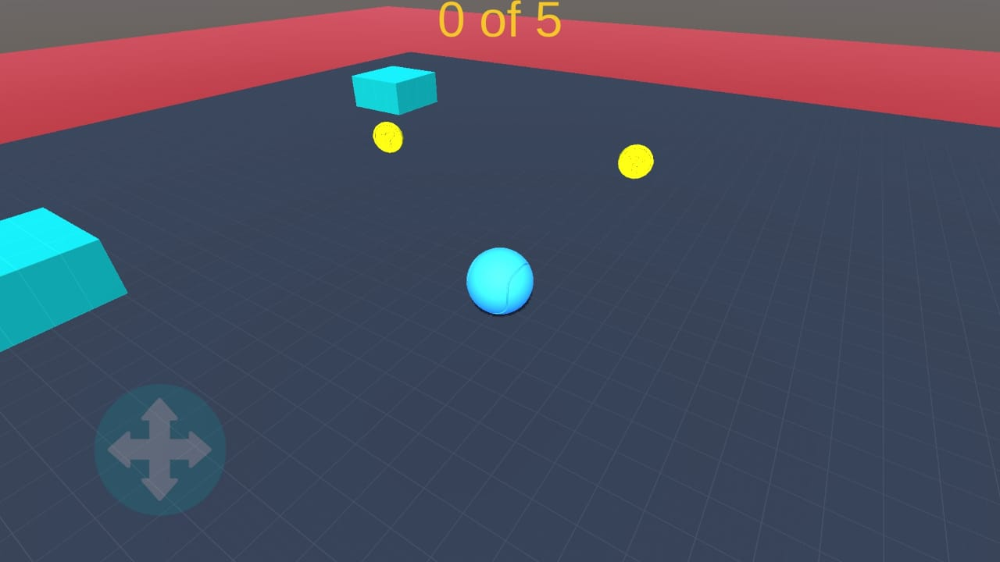
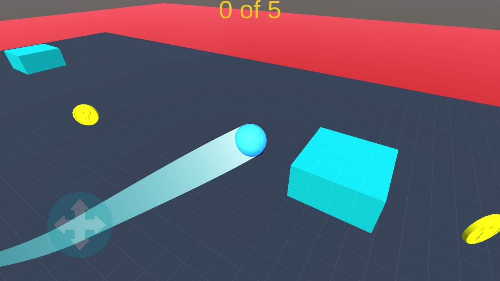

# Roller-Madness
 
> This project is the 2nd assignment of "[Introduction to Game Development](coursera.org/learn/game-development/)" course by [Coursera](https://www.coursera.org/).

- In this game you have to move the rolling ball and collect coins to pass the level.

- avoid collision with the enemy objects.

### Screenshots

